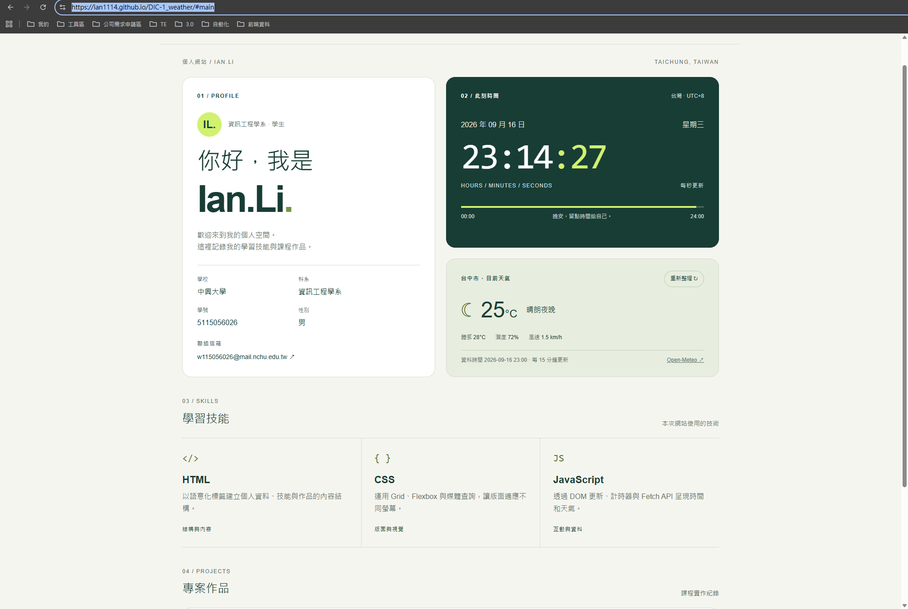

# AIoT-DA 課程 — DIC-1（Do in Class 1）專案說明文件

- **課程名稱：** AIoT 與數據分析（AIoT & Data Analytics, AIoT-DA）
- **課堂實作：** DIC-1 (Do in Class 1) — 個人入口網站與動態時鐘儀表板（Personal Portal & Live Timekeeper）
- **授課單元：** Lecture 2 — 瀏覽器、現代 Web 核心與非同步資料流（L2Web）
- **示範教師：** Huan Chen
- **儲存庫網址：** [https://github.com/Ian1114/hw1_weather](https://github.com/Ian1114/hw1_weather)
- **Live Demo Page：** [https://ian1114.github.io/hw1_weather/#main](https://ian1114.github.io/hw1_weather/#main)

## 網站截圖

